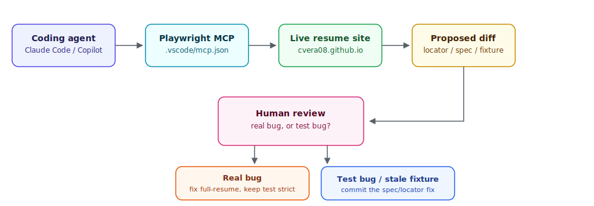

# Playwright MCP — Resume QA Suite

[](https://github.com/cvera08/test-playwright-mcp/actions/workflows/playwright.yml)

End-to-end test suite built with **Playwright** and **TypeScript**, using the **Page Object Model** pattern, integrated into **CI/CD via GitHub Actions**, and authored/maintained with AI-agent assistance through the [Playwright MCP server](https://github.com/microsoft/playwright-mcp).

Target under test: [cvera08.github.io/full-resume](https://cvera08.github.io/full-resume/) — my own live resume site. Dogfooding the same rigor I'd apply to a production product: content integrity, outbound link health, SEO/social preview correctness, accessibility, and responsive layout.

## Stack

- Playwright 1.55+ · TypeScript · Node.js
- Page Object Model (`pages/ResumePage.ts`)
- `@axe-core/playwright` for accessibility checks
- GitHub Actions (Chromium, Firefox, WebKit)

## Structure

```
pages/                    — ResumePage: locators + low-level page interactions
tests/
  content.spec.ts         — data-driven section rendering checks
  links.spec.ts           — outbound project links + PDF download resolve
  meta-tags.spec.ts       — og:image / og:url / canonical resolve correctly
  accessibility.spec.ts   — axe-core scan, no critical/serious violations
  responsive.spec.ts      — no horizontal overflow across mobile/tablet/desktop
  fixtures/                — expected section titles & links, mirrors full-resume/_data/data.yml
.github/                  — CI pipeline running on push
docs/AI-WORKFLOW.md       — how MCP-assisted agents help author/maintain this suite
```

## Run locally

```bash
npm ci
npx playwright install --with-deps
npx playwright test
```

To run a specific spec:

```bash
npx playwright test tests/content.spec.ts
```

To open the HTML report after a run:

```bash
npx playwright show-report
```

## CI

Tests run automatically on every push across **3 browsers** (Chromium, Firefox, WebKit). HTML report artifact is uploaded on every run for easy debugging.

## Architecture

`pages/ResumePage.ts` owns all locators and page-level reads (meta tags, canonical link, project link hrefs). Specs stay declarative and only orchestrate assertions, so a markup change to the resume theme means updating one file, not every spec.

`tests/fixtures/expectedSections.ts` mirrors the section titles and project links defined in `full-resume/_data/data.yml`, making the content checks data-driven against the actual CV source of truth rather than hardcoded per test.

## AI-assisted workflow

The "MCP" in this repo's name isn't decoration — `.vscode/mcp.json` wires up the [Playwright MCP server](https://github.com/microsoft/playwright-mcp), and that's the actual tool used to author and maintain these specs: a coding agent (Claude Code, Copilot agent mode) drives it to inspect the live resume's DOM, propose locators, and validate specs against the real page before a human reviews and commits.



- **Locator discovery**: the agent navigates the live site through MCP and proposes selectors for `pages/ResumePage.ts`, instead of hand-inspecting DevTools.
- **Fast iteration**: when a spec fails, the agent re-runs it, reads the trace, and proposes a fix — a human decides whether it's a test bug or a real regression.
- **Maintenance trigger**: when `full-resume/_data/data.yml` changes, an agent re-reads the live page and proposes the diff to `tests/fixtures/expectedSections.ts`.

The scope is deliberately narrow: this is an agent authoring and maintaining *deterministic* Playwright tests faster — not LLM/agent output evaluation (no Ragas, no LLM-as-a-judge here; that's a different repo, a different tier).

> The agent proposes; a human decides what's worth asserting and what a failure means. The clearest example: when `meta-tags.spec.ts` started failing, the agent could have just loosened the assertion to make it green again. Instead the failure was treated as a real production bug, root-caused, and fixed at the source — the test stayed strict, the site got fixed.

Full writeup: [`docs/AI-WORKFLOW.md`](docs/AI-WORKFLOW.md).

## Found in production

First local run against the live site: **45 passed, 12 failed** — every failure was a real bug, not a test bug.

- **SEO / social preview (`tests/meta-tags.spec.ts`, 9 of the 12 failures):** `og:image`, `og:url`, and the canonical link were resolving to a duplicated path (`/full-resume/full-resume/...`, 404). Root cause: `site.url` in `full-resume/_config.yml` already included `/full-resume`, and GitHub Pages' Jekyll build injects it again as `baseurl`. Silently broke link previews on LinkedIn/Slack/WhatsApp. Fixed at the source: `full-resume@352ae93`.
- **Accessibility (`tests/accessibility.spec.ts`, 3 of the 12 failures):** date/location text (`$text-third-color`, `#97AAC3`) had a 2.37:1 contrast ratio against white — under the 4.5:1 WCAG AA minimum. Fixed at the source: `full-resume@ad31ac2` (darkened to `#5C7089`, 5.08:1).
- **Accessibility, accepted tradeoff:** the same scan also flagged the section-title heading color (`#1DA1F2`, 2.82:1) below AA. Tried a darker, compliant shade (`#0E6FAE`, 5.38:1) first, but reverted after side-by-side review — that color is shared with the favicon and with `CVeraPortfolio`'s accent color across 8+ usages, and informal feedback preferred the lighter blue's visual emphasis on headings. Kept `#1DA1F2` and scoped the a11y check to accept this specific, documented violation rather than silently drop accessibility coverage altogether.

These runs happened locally before the fixes landed, so CI never recorded a red run for them — this section is the paper trail instead. Root-cause commits are in `full-resume`, not this repo.

## Next Steps

- Add visual regression snapshots for key sections
- Extend `fixtures/expectedSections.ts` generation to read `data.yml` directly (see `docs/AI-WORKFLOW.md`)
